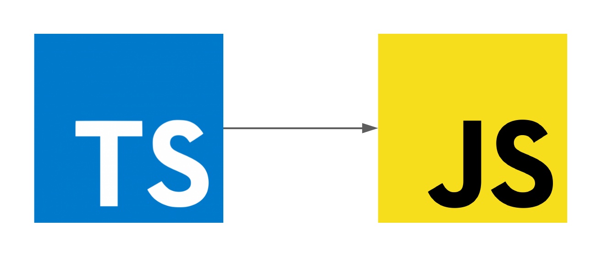

<h1 style="text-align: center;">TypeScript</h1>

Table of Contents
=================

   * [TypeScript](#typescript)
   * [Introduction](#introduction)
      * [What is TypeScript?](#what-is-typescript)
         * [What does it add?](#what-does-it-add)
      * [Why TypeScript?](#why-typescript)
      * [Requirements](#requirements)
         * [Install typescript](#install-typescript)
      * [Overview](#overview)
   * [Basics](#basics)
      * [Core Types](#core-types)
         * [Using types](#using-types)
         * [Type Inference](#type-inference)
         * [Object types](#object-types)
         * [Array types](#array-types)
      * [More Types](#more-types)
         * [Tuples](#tuples)
         * [Enum](#enum)
      * [Union Types](#union-types)
      * [Literal Types](#literal-types)
      * [Type Aliases](#type-aliases)
      * [Function Return Types](#function-return-types)
         * [Function as Types](#function-as-types)
      * [Unknown Type](#unknwon-type)
      * [Never Type](#never-type)
   * [TS Compiler](#ts-compiler)
      * [Command Options](#command-options)
      * [Flags in tsconfig](#flags-in-tsconfig)
   * [Classes and Interfaces](#classes-and-interfaces)
      * [Classes](#classes)
         * [Private Modifiers](#private-modifiers)
         * [Public Modifiers](#public-modifiers)
         * [Shorthand Initialization](#shorthand-initialization)
         * [Read-only Modifier](#read-only-modifier)
         * [Inheritance](#inheritance)
         * [Getters and Setters](#getters-and-setters)
         * [Static Properties and Methods](#static-properties-and-methods)
         * [Abstract Classes](#absract-classes)
         * [Private Constructors](#private-constructors)
      * [Interfaces](#interfaces)
         * [Interfaces with Classes](#interfaces-with-classes)
         * [Inheritance with Interfaces](#inheritance-with-interfaces)
         * [Interfaces as Function Types](#interfaces-as-function-types)
         * [Optional Parameters](#optional-parameters)
   * [Advanced Types Concepts](#advanced-types-concepts)
      * [Intersection Types](#intersection-types)
      * [Type Guards](#type-guards)
      * [Discriminated Unions](#discriminated-unions)
      * [Type Casting](#type-casting)
      * [Index Properties](#index-properties)
      * [Function Overloads](#function-overloads)
      * [Optional Chaining](#optional-chaining)
      * [Nullish Coalescing](#nullish-coalescing)
   * [Generics](#generics)
      * [What are generics?](#what-are-generics)
      * [Custom Generic](#custom-generic)
         * [Functions](#functions)
         * [Constraints](#constraints)
            * [KeyOf Constraint](#keyof-constraint)
      * [Generic Classes](#generic-classes)
      * [Generic Utility Types](#generic-utility-types)
            * [Partial](#partial)
         * [Readonly](#readonly)
      * [Generic vs Union Types?](#generic-vs-union-types)
   * [Decorators](#decorators)
      * [DISCLAIMER](#disclaimer)
      * [Decorators Factories](#decorators-factories)
      * [Example](#example)
      * [Property Decorators](#property-decorators)
      * [Returning in a decorator](#returning-in-a-decorator)
   * [Modules](#modules)
      * [Namespaces and File Bundling](#namespaces-and-file-bundling)
         * [Result](#result)
      * [ES6 Modules](#es6-modules)
         * [Syntax](#syntax)
         * [tsconfig](#tsconfig)
         * [IMPORTANT](#important)
   * [Webpack](#webpack)
      * [What is Webpack?](#what-is-webpack)
      * [Install](#install)
      * [Configurations](#configurations)
      * [How to use Webpack](#how-to-use-webpack)
      * [Dev Workflow](#dev-workflow)
      * [Production Workflow](#production-workflow)
         * [Useful Requirements](#useful-requirements)
   * [NodeJS and Express](#nodejs-and-express)
      * [Useful stuff](#useful-stuff)
   * [Credits](#credits)


# Introduction

## What is TypeScript?

TypeScript is a JavaScript superset, which means that it is a language that builds up on JavaScript. It adds **new features and advantages** to JS.

Browsers and Node.js can't execute TypeScript.

TypeScript is more of a compiler that compiles code to JavaScript, it basically transforms your code into JS.



### What does it add?

Most importantly, as the name suggests, it adds ``types`` to the JS language. This can be useful to prevent ``runtime`` errors.

## Why TypeScript?

Let's assume this JS code:

```javascript
function add(num1, num2) {
    return num1 + num2;
}

add("1", "2");
```

We are passing strings to a function that should sum two numbers, this won't generate an error in JS but we will not receive the expected output (unwanted behavior at Runtime).

To fix this in JS we would need to do something like:

```javascript
if (typeof num1 === "number" && typeof num2 === "number")
```

TypeScript can really help us in situations like this:

```typescript
function add(num1: number, num2: number) {
    return num1 + num2;
}
```

With this extra syntax we openly state that we should only expect numbers.


## Requirements

* Node.js
* TypeScript npm package

### Install typescript

``npm i -g typescrypt``


## Overview

TypeScript adds:

* Types
* Next-gen JS Features compiled down for older Browsers
* More features such as Interfaces or Generics
* Meta-Programming Features like Decorators
* Rich Configuration Options
* Modern tooling that helps even non TypeScript Projects (especially in IDEs).


# Basics

## Core Types

In TypeScript we have the following types (and more):

* number (all numbers)
* string
* boolean
  * no truthy or falsy values
* object
* array
* any
  * it is as flexible as writing normal JS
* undefined
* Function
* unknown
  * a value that is not guaranteed to be something.
* void
* never


### Using types

 ```typescript
function add (num1: number, num2: number) {
    return num1 + num2;
}

const n1 = 10;
const n2 = 3.2;

const result = add(n1, n2);
 ```

**TypeScript's type system only helps you during development**.


### Type Inference

TypeScript is smart enough to recognize some non-explicit variable types such as

```typescript
let number1 = 5; // number1: number
```

 We could do

```typescript
let number1: number = 1;
```

We can also declare variables without values:

```typescript
const n1: number;
```


### Object types

Object properties in TS are stricter than in JS, if we have a `person` object:

```typescript
const person = {
    name: 'Leonardo',
    age: 17
};
```

We can't access `person.nickname`.

This is a 'generic' object, in TS we can be more specific:

```typescript
const person: { name: string, age: number } = {
    name: 'Leonardo',
    age: 17
};
```

In this case the object **must only have** a name property and an age property.

But this is not `best practice` since TS can pick it up on its own just by doing like in the example before this one.


### Array types

TS describes an array with ``type[]`` where type can be `string, number ...`

So we can declare an array like this:

```typescript
const arr: string[];
```

And we can only add strings.

If we want a `mixed` array we can use the `any` type.


## More Types

TS has some new types.


### Tuples

Fixed length and fixed content arrays.

```typescript
const person: { name: string, age: number, role: [number, string] } = {
    name: 'Leonardo',
    age: 17,
    role: [1, 'admin']
};
```

**NOTE:**  ``push`` is allowed in tuples even if, in this example, you can't manually create a 'role' tuple with more than 2 elements (or less than 2).


### Enum

They assign labels to numbers and are useful for constant identifiers.

```typescript
enum Role { ADMIN, READ_ONLY, AUTHOR };

const person: {
    name: string,
    age: number,
    role: Role.ADMIN
} = {
    name: 'Leonardo',
    age: 17,
    role: [1, 'admin']
};
```

We can assign custom **values** (numbers...) to them if we want.

```typescript
enum Role { ADMIN = 100, READ_ONLY = "abc", AUTHOR = 12 };
```


## Union Types

We can specify more than a type to a variable with `union types`.

```typescript
const someVariable: string | number;
```


## Literal Types

Literal types are used to specify a precise value to assign to a variable. Especially useful for string identifiers or flags.

```typescript
function doSomething(param1: number, param2: number, flag: 'do-this' | 'dont-do-this') {
    // code...
}
```


Here `flag` can only be:

* do-this
* dont-do-this


## Type Aliases

We can create aliases for types:

```typescript
type MyCustomType = number | string;
type AnotherType = ':)';
```


## Function Return Types

We can specify a return type to returns:

```typescript
function printResult (n1: number, n2: number): void {
    console.log('Result: ', + (n1+ n2));
}
```

We obviously don't need to specify it in this case.


### Function as Types

Variables can hold a ``function``.

```typescript
const someVariable: Function;
```

We can even be more specific by doing:

```typescript
// this is a function with NO arguments that returns a NUMBER
const temp = () => number;
```

This can also be useful to specify ``callbacks``.

## Unknown Type

Unknown is more restrictive than `any`.

For example we CAN'T do:

```typescript
let a: unknown;
let b: string;

a = 5;
a = 'abc';

// NO
b = a;
```

 This example would work in case of the `any` type.

## Never Type

```typescript
function generateError(message: string, code: number): never {
    throw { message: message, errorCode: code};
}

generateCode('Error Message', 500);
```

This function `never` returns a value. It is a special case (it crashes our program and stops there).


# TS Compiler

To compile code we run ``tsc file.ts``. But we can configure it with a `tsconfig.json`.

## Command Options

| --watch | Watch Mode to avoid compiling a file every time              |
| ------- | ------------------------------------------------------------ |
| --init  | Init a project (compile multiple files and create tsconfig.json) |

## Flags in tsconfig

| exclude       | exclude files from compilation / node_modules                |
| ------------- | ------------------------------------------------------------ |
| include       | include files for compilation                                |
| files         | points/specify files                                         |
| target        | ECMAScript target version                                    |
| module        | module system                                                |
| lib           | specify libraries (DOM)                                      |
| checkJs       | reports errors in .js files                                  |
| sourcemap     | bridge to connect the js files to the input ts files (we can see ts files in the source tab in the browser) |
| outDir        | specify where the created js will be stored                  |
| rootDir       | specify where to grab the ts files                           |
| noEmitOnError | don't emit js files if an error occurs                       |

And many more.


# Classes and Interfaces

## Classes

```typescript
class Department {
    // attributes
    name: string;

    // constructor
    constructor(n: string) {
        this.name = n;
    }

    // methods
    printName(this: Department) { // ts feature to specify that this method should run only on a Department object
        console.log(this.name);
    }
}

const dep = new Department('Dep Name');
```


### Private Modifiers

```typescript
class Department {
    private name: string;
    private employees: string[] = [];

    constructor(n: string) {
        this.name = n;
    }

    printName(this: Department) {
        console.log(this.name);
    }

    addEmployee(employee: string) {
        this.employees.push(employee);
    }
}
```

Properties are now accessible only in the class (not in [child](#Inheritance) classes).

In order to share `private` properties to child classes thru [Inheritance](#Inheritance) use the `protected` keyword.


### Public Modifiers

Public is the default option so we don't need to set it.

```typescript
class Department {
    public name: string;
    public employees: string[] = [];

    constructor(n: string) {
        this.name = n;
    }

    printName(this: Department) {
        console.log(this.name);
    }

    addEmployee(employee: string) {
        this.employees.push(employee);
    }
}
```


### Shorthand Initialization

```typescript
class Department {
    // public name: string;
    // public employees: string[] = [];

    constructor(private name: string, public employees: string[]) {
        // this.name = n;
    }

    printName(this: Department) {
        console.log(this.name);
    }

    addEmployee(employee: string) {
        this.employees.push(employee);
    }
}
```


### Read-only Modifier

```typescript
class Department {
    private readonly  name: string;
    private employees: string[] = [];

    constructor(n: string) {
        this.name = n;
    }

    printName(this: Department) {
        console.log(this.name);
    }

    addEmployee(employee: string) {
        this.employees.push(employee);
    }
}
```

We can't modify the name property.


### Inheritance

```typescript
class Department {
    private readonly  name: string;
    private employees: string[] = [];

    constructor(n: string) {
        this.name = n;
    }

    printName(this: Department) {
        console.log(this.name);
    }

    addEmployee(employee: string) {
        this.employees.push(employee);
    }
}

class ITDepartment extends Department {
    constructor(id: string) {
        super('IT');
        this.id = id;
    }
}
```

We can also override parent methods in child classes by re-declaring them.


### Getters and Setters

In order to access `private` attributes from the outside of a class we can implement `getters` and `setters`.

```typescript
class Department {
    private name: string;

    constructor(n: string) {
        this.name = n;
    }

    get name(this: Department) {
        return this.name;
    }

    set name(value: string) {
        this.name = value;
    }

}

const d = new Department();

// Getter
console.log(d.name) // with no ()

// Setter
d.name = "Name";
```

We access them as `properties` and not methods.


### Static Properties and Methods

Properties and Methods that we don't access from an instance. An example is `Math`.

```typescript
class Department {
    private name: string;

    constructor(n: string) {
        this.name = n;
    }

    static createEmployee(name: string) {
        return { name: name };
    }

}

Department.createEmployee('Leo');
```


### Abstract Classes

Back to Inheritance, we can force developers to implement a certain method in a class (especially child ones).

```typescript
abstract class Department {
    private readonly  name: string;
    private employees: string[] = [];

    constructor(n: string) {
        this.name = n;
    }

    printName(this: Department) {
        console.log(this.name);
    }

    addEmployee(employee: string) {
        this.employees.push(employee);
    }

    // we are just saying that every child must implement this method.
    abstract mandatoryMethod(this: Department): void;
}

class ITDepartment extends Department {
    constructor(id: string) {
        super('IT');
        this.id = id;
    }

    mandatoryMethod() {
        // code
    }
}
```

`abstract` classes **CAN'T BE INSTANTIATED**


### Private Constructors

Singleton Pattern = have only one instance of a class.

With private constructors we can't use `new ClassName()` outside of the class.

```typescript
class ITDepartment extends Department {
    // we need to provide an instance otherwise we can't create it with the 'new' keyword
    private static instance: ITDepartment;

    private constructor(id: string) {
        super('IT');
        this.id = id;
    }

  	static getInstance() {
        if (ITDepartment.instance) {
            return this.instance;
        }

        this.instance = new ITDepartment();
    }
}

const it = ITDepartment.getInstance();
const it2 = ITDepartment.getInstance();

// it === it2
```


## Interfaces

An interfaces describes the structure of an object (not the same thing as a custom type).

```typescript
interface Person {
    name: string;
    age: number;

    printName(): void;
}

let user: Person;

user = {
    name: 'Leonardo',
    age: 17,
    printName: function () {
        console.log(this.name);
    }
}
```

We can also add `readonly` to properties.

### Interfaces with Classes

We can implement an interface in a class.

```typescript
interface Greetable {
    name: string;

    greet(): void;
}

class Person implements Greetable {
    name: string;

    constructor(name: string) {
        this.name = name;
    }

    greet() {
        console.log(this.name);
    }
}

let user: Greetable;

user = new Person('Leo');
```

The interface acts like a strict blueprint.


### Inheritance with Interfaces

```typescript
interface Named {
    readonly name: string
}

interface Greetable extends Named {
    greet(): void
}

interface AnotherInterface {
    readonly someValue: string
}

class Person implements Greetable, AnotherInterface {
    name: string;
    someValue: string;

    constructor(name: string) {
        this.name = name;
    }

    greet() {
        console.log(this.name);
    }
}
```


### Interfaces as Function Types

```typescript
interface AddFn {
    (a: number, b:number): number;
}

let add: AddFn;

add = (n1: number, n2: number) => {
    return n1 + n2;
}
```


### Optional Parameters

```typescript
interface Person {
    name: string;
    lastName?: string
}
```

`lastName` will be optional

**We can have optional parameters even in function and classes.**


# Advanced Types Concepts


## Intersection Types

```typescript
type Admin = {
    name: string;
    priviliges: string[];
};

type Employee = {
    name: string;
    startDate: Date;
};

type ElevatedEmployee = Admin & Employee;
```

It's the same thing as `extending` interfaces.

```typescript
type Type1 = string | number;
type Type2 = number | boolean;

type Intersection = Type1 & Type2; // --> number
```


## Type Guards

```typescript
type Combinable = string | number;

function add(a: Combinable, b: Combinable) {
    if (typeof a === 'string' || typeof b === 'string') { // this is a type guard
        return a.toString() + b.toString();
    }

    return a + b;
}
```

In case of combined types:

```typescript
type Admin = {
    name: string;
    priviliges: string[];
};

type Employee = {
    name: string;
    startDate: Date;
};

type UnknownEmp = Admin | Employee; // admin OR employee

function printEmpInfo(emp: UnknownEmp) {
    console.log(emp.name);
    if ('priviliges' in emp) { // type guard
        console.log(emp.priviliges);
    }
}
```

Or we could use `instanceof` as a type guard.


## Discriminated Unions

```typescript
interface Bird {
    type: 'bird'; // literal type
    flyingSpeed: number;
}

interface Horse {
    type: 'horse';
    runningSpeed: number;
}

type Animal = Bird | Horse;

function moveAnimal(animal: Animal) {
    let speed;
    switch (animal.type) {
        case 'bird':
            speed = animal.flyingSpeed;
        case 'horse':
            speed = animal.runningSpeed;
    }

    console.log("Moving at speed: ", speed);
}
```


 ## Type Casting

We basically specify the type of something, useful especially when manipulating the DOM:

```typescript
const inputEl = <HTMLInputElement>document.getElementById('user-input')!; // ! means that we tell TS not to worry about the fact that maybe inputEl doesn't exist.

inputEl.value = "Hi there!"; // we can safely access value because we are telling TS that inputEl is going to be HTMLInputElement, otherwise it complains about the fact that the value property may not exist.
```

But this uses the same syntax as some React stuff (I don't know React I use Vue xD) so in that case we use the `as` keyword:

```typescript
const inputEl = document.getElementById('user-input')! as HTMLInputElement;
```


## Index Properties

We use them to build flexible interfaces.

```typescript
interface ErrorCOntainer { // flexible container
    [prop: string]: string; // every property we add must be a string, it is like a 'general keyword'
    id: string; // OK
    code: number; // NO
}
```

We specify that properties names and their values must be strings BUT we don't actually know the properties.


## Function Overloads

```typescript
type Combinable = string | number;

function add(a: number, b: number): number; // if both params are number then return a number
function add(a: Combinable, b: Combinable) {
    if (typeof a === 'string' || typeof b === 'string') { // this is a type guard
        return a.toString() + b.toString();
    }

    return a + b;
}
```

It is similar to an if statement but related to function params. It gets 'translated' to: if we call the function 'add' with two numbers then expect back a number. So later in the code we can handle the result as a number (we can use numbers related methods without warnings).


## Optional Chaining

Useful when we fetch data from an API and we don't know if the result as some properties.

```typescript
const fetchedData = {
    id: 'u1',
    name: 'Leo',
    // job: {title: 'CEO', payCheck: 10000} ---> imagine that this doesn't get fetched correctly
};

console.log(fetchedData.job.title) // ERROR
```

We can solve this by adding a `?` to the object

```typescript
console.log(fetchedData.job?.title) // ERROR
```


## Nullish Coalescing

If we don't know if a piece of data is `null` we can do:

```typescript
const gotData = null; // data that we don't know if it is NULL

const storedData = gotData || 'Default'; // JS
const storedData = gotData ?? 'Default'; // TS --> ONLY IF gotData is null or undefined
```


# Generics

They don't exist in JavaScript but the concept of Generic Types exist in other programming languages.

An array is actually a `generic`.

## What are generics?

``Array<Type>``

A generic type is a type which is kinda connected with some other types and is really flexible in terms of what type the other type is.

The `Array` type doesn't really care about what data you store in it.

```typescript
const names: Array<string> = []; // same thing as string[]
```


Another generic type is `Promise`.

```typescript
const promise = new Promise((resolve, reject) => {
    setTimeout(() => {
        resolve('Done');
    }, 1000)
});
```

Here the type of the promise is `Promise<unknown>` because it will eventually resolve into something.

So we can say:

```typescript
const promise: Promise<string> = new Promise((resolve, reject) => {
    setTimeout(() => {
        resolve('Done');
    }, 1000)
});
```

We specify that the promise eventually resolves into a `string`.

Generic types gives us more safety.


## Custom Generic

### Functions

```typescript
function merge(objA: object, objB: object) {
    return Object.assign(objA, objB);
}

const merged = merge({name: 'Leo'}, {age: 17});
merged.age; // TS ERROR, typescript doesn't know the properties (we could do TYPE CASTING or GENERIC TYPES)
```

```typescript
function merge<T, U>(objA: T, objB: U) { //T and U are cusotm identifiers
    return Object.assign(objA, objB);
}

// THIS FUNCTION RETURNS THE INTERSECTION OF T AND U
const merged = merge({name: 'Leo'}, {age: 17}); // name: string & age: number
```

They are used to specify that what we store in the result is the intersection between the parameters (we actually don't know what they are 'made of').

We can also specify what parameters we are passing:

```typescript
const merged = merge<{name: string}, {age: number}>({name: 'Leo'}, {age: 17});
```

**But this is redundant.**


### Constraints

Sometimes we want to **restrict** the types of generic types.

```typescript
function merge<T extends object, U extends object>(objA: T, objB: U) { //T and U are cusotm identifiers
    return Object.assign(objA, objB);
}
```

So we have improved the merge function by reducing unwanted behaviors such as passing just a number to the `merge` function.

We can also improve this by creating custom `interfaces` and using them with `extends ...` if we only care about certain params properties.


#### KeyOf Constraint

```typescript
function extractAndConvert(obj: object, key: string) {
    return obj[key]; // TS ERROR since we don't know if the object has the key property
}
```

We can fix this by using `generics`

```typescript
function extractAndConvert<T extends object, U extends keyof T>(obj: T, key: U) {
    return obj[key]; // OK
}
```


## Generic Classes

```typescript
class DataStorage<T extends number | string | boolean> {
    private data: T[] = [];

    addItem(item: T) {
        this.data.push(item);
    }

    removeItem(item: T) {
        if (this.data.indexOf(item) !== -1) this.data.splice(this.data.indexOf(item), 1);
    }

    getItems() {
        return [...this.data];
    }
}

const textStorage = new DataStorage<string>();
const numberStorage = new DataStorage<number>();
```


## Generic Utility Types

Special Utility Types.

#### Partial

```typescript
interface Article {
    title: string;
    description: string;
}

function createArticle(title: string, description: string): Article {
    const toServe: Partial<Article> = {}; // This is an object that in the **end** will be an Article

    // building manually, maybe we have to do some filtering
    toServe.title = title;
    toServe.decription = description;

    return toServe as Article;
}
```


### Readonly

```typescript
const names: Readonly<string[]> = ['Leo', 'Anna'];
```


## Generic vs Union Types?

```typescript
class DataStorage<T extends number | string | boolean> {
    private data: T[] = [];

    addItem(item: T) {
        this.data.push(item);
    }

    removeItem(item: T) {
        if (this.data.indexOf(item) !== -1) this.data.splice(this.data.indexOf(item), 1);
    }

    getItems() {
        return [...this.data];
    }
}
```

```typescript
class DataStorage {
    private data: (string | number | boolean)[] = [];

    addItem(item: string | number | boolean) {
        this.data.push(item);
    }

    removeItem(item: string | number | boolean) {
        if (this.data.indexOf(item) !== -1) this.data.splice(this.data.indexOf(item), 1);
    }

    getItems() {
        return [...this.data];
    }
}
```

In the second example we allow **mixed** types, to fix that we would have to do ``string[] | number[] | boolean[]`` BUT then we would have a problem while adding and removing stuff because with union types we allow some types every time we call that specific action.

So generic types makes us choose a type of data every time from a range of types, it doesn't accept mixed stuff.

In order words generics locks in a specific type.


# Decorators

## DISCLAIMER

Decorators are much more in depth than how they are described in this chapter so more knowledge [here](More [here](https://www.typescriptlang.org/docs/handbook/decorators.html)).


Writing code that's easier to use for developers.

Decorators are usually about classes and they are **functions**.

**MUST USE WITH ES6 AND EXPERIMENTAL-DECORATORS in TSCONFIG.JSON**


```typescript
function Logger(constructor: Function) { // decorators expect arguments
    console.log("Logging");
    console.log(constructor);
}

@Logger
class Person {
    name: 'Leo';

    constructor() {
        console.log("Creating person...");
    }
}
```

They run without an instance, so they execute when you define a class.


## Decorators Factories

They create decorators that we can configure.

```typescript
function Logger(logString: string) {
    return function(constructor: Function) {
        console.log(logString);
    	console.log(constructor);
    }
}

@Logger('LOGGING-PERSON')
class Person {
    name: 'Leo';

    constructor() {
        console.log("Creating person...");
    }
}
```


## Example

```typescript
function WithTemplate(template: string, hookId: string) {
    return function(_: Function) { // we could pass a class constructor
        const hookEl = document.getElementById(hookId);
        if (hookEl) {
            hookEl.innerHTML = template;
        }
    }
}

@WithTemplate('<h1>Lorem Ipsum</h1>', 'app'); // app is an ID on a DIV
```

This is like an Angular Decorator.

We can also have multiple decorators per class and they execute from the bottom to the top.


## Property Decorators

```typescript
function Log(target: any, propertyName: string | Symbol) {
    console.log(target, propertyName);
}

class Product {
    @Log
    title: string;

    constructor(t: string) {
        this.title = t;
    }

}
```

**We can also create decorators for methods and accessors**.

## Returning in a decorator

When can also return stuff in decorators, especially we can return classes.


NOTE: this will decorate a class with a ``name`` property

```typescript
function WithTemplate(template: string, hookId: string) {
    return function<T extends {new(...args: any[]): {name: string}}>(original_constructor: T) {
        return class extends original_constructor { // based on the og constructor
            // adding new functionalities to the decorated class, this runs when the class is instantiated
            constructor(..._: any[]) {
                super();
                const hookEl = document.getElementById(hookId);
                if (hookEl) {
                    hookEl.innerHTML = this.name;
                }
            }
        }
    }
}
```

This basically replace the class that it decorated by keeping its original values.

We can also return in method decorators.


# Modules

## Namespaces and File Bundling

Use "namespace" code syntax to group code. Bundled compilation is possible.

In a specific file (``fileName.ts``)

```typescript
namespace AModule {
    // code here
    export interface numberOne {}
    export interface numberTwo {}
}
```

And we import it as follows:

```typescript
/// <reference path="fileName.ts" />
```

**But we can't access the single interfaces without putting the "main code" into a namespace with the same name as the exported one.**


### Result

We get back multiple files but **they aren't linked between each other**. In order to link them we have to  set the ``outFile`` option in `tsconfig` which bundles everything in one file and we also need to set the `module` option to `amd`.

## ES6 Modules

Modern JavaScript  uses ES6 Imports/Exports. TypeScript also supports this. Bundling via third-party tools is possible.

### Syntax

```typescript
import defModule from './path/file.js'
import { module } from './path/another.js'
```

As long as we don't use a ``webpack`` make sure to add `.js` even if we are developing in TypeScript or just omit the extension (this can cause some errors depending on you environment).


We can obviously use ``default`` exports and other features.

### tsconfig

We need to set these flags in the ``tsconfig.json``

```
target: es6 (or higher)
module: es2015 (or higher)
```

We can't use the `outfile` flag.

### IMPORTANT

In a HTML file we have to add the `module` flag.

```html
<script type="module" src="index.js"></script>
```

Modules get executed the first time they get imported in the app even though we import a single one multiple times in different files.


# Webpack

## What is Webpack?

Splitting code in multiple modules result in a lot of ``http requests``.

Webpack is a tool to bundle files together (Build Orchestration Tool).

It also optimizes our code (minimized code, less imports, etc).

## Install

```
npm install --save-dev webpack webpack-cli webpack-dev-server typescript ts-loader
```

**Installing a copy of `typescript` in every project is a good practice in order not to break an existing project if typescript gets updated with deep new features.**

## Configurations

In `tsconfig.json`

```
target: es5/es6/esnext
module: es2015/es6
NO rootDir
sourceMap: true --> helps debugging
```

``webpack.config.js``

```javascript
const path = require('path');

module.exports = {
    entry: './src/apps.ts', // root project entry
    output: {
    	filename: 'bundle.js' // out file
    	path: path.resolve(__dirname, 'dist') // absolute path (same as the on ein tsconfig)
	},
    devtool: 'inline-source-map', // alreay generated source maps (tsconfig)
    // instructions on how to deal ts files
    module: {
        rules: [
            {
                test: /\.ts$/,
                use: 'ts-loader',
                exclude: /node_modules/
            }
        ]
    },

    resolve: {
        extensions: ['.ts', '.js']
    }
};
```

REMOVE ALL EXTENSIONS IN IMPORT STATEMENTS

## How to use Webpack

in ``package.json``

```json
"build" : "webpack"
```

And then we can use the generated file.

## Dev Workflow

in `package.json`

```json
"dev" : "webpack-dev-server"
```

**In dev mode the bundle is generated in memory only**

So we need to add (in `webpack.config.js`):

```js
mode: 'development' // fewer optimizations
publicPath: 'dist'
```

## Production Workflow

### Useful Requirements

```
npm i --save-dev clean-webpack-plugin
```

To clear the bundle every time we have a new version.

``webpack.config.prod.js``

```javascript
const path = require('path');
const CleanPlugin = require('clean-webpack-plugin');

module.exports = {
    mode: 'production',
    entry: './src/apps.ts', // root project entry
    output: {
    	filename: 'bundle.js' // out file
    	path: path.resolve(__dirname, 'dist') // absolute path (same as the on ein tsconfig)
	},
    devtool: 'none', // alreay generated source maps (tsconfig)
    // instructions on how to deal ts files
    module: {
        rules: [
            {
                test: /\.ts$/,
                use: 'ts-loader',
                exclude: /node_modules/
            }
        ]
    },

    resolve: {
        extensions: ['.ts', '.js']
    },
	plugins: [
    	new CleanPlugin.CleanWebpackPlugin()
    ]
};
```


``package.json``

```json
"build" : "webpack --config webpack.config.prod.js"
```


# NodeJS and Express

Node is not able to run `TypeScript` files. We could install ``ts-node`` but it is not good for production.

What we can do is:

* npm init
* tsc --init
* `target: esnext`
* `moduleResolution: node`
* npm i express
* npm i --save-dev nodemon
* npm i --save-dev @types/node
* npm i --save-dev @types/express

## Useful stuff

```typescript
import { RequestHandler } from 'express';

export const controller: RequestHandler = (req, res, next) => {}
```


```typescript
import { Request, Response, NextFunction } from 'express';
```


# Credits

Extended cheatsheet made by Leonardo Folgon and made by following various resources on the internet.
